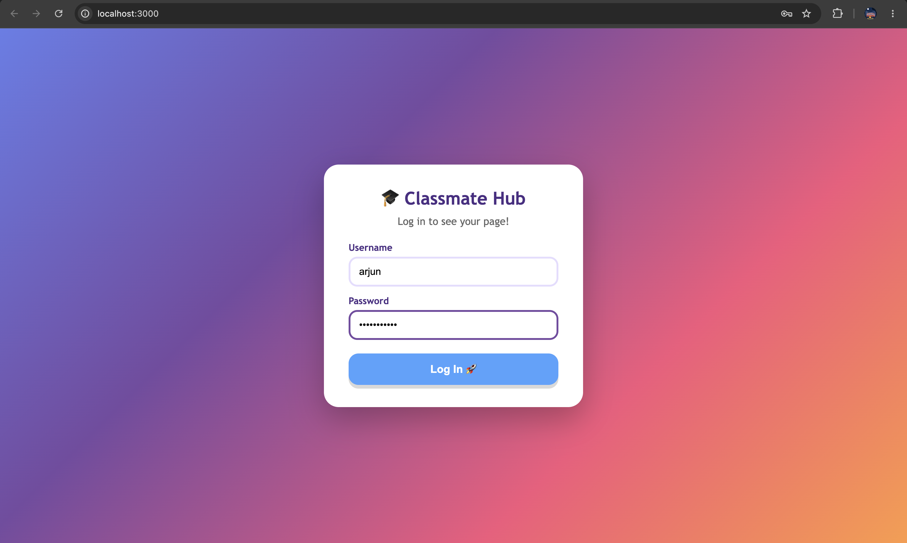
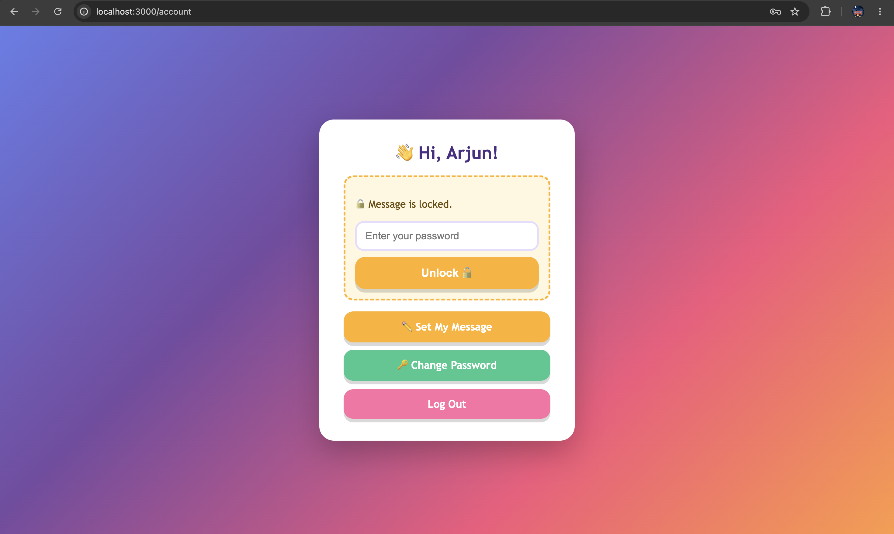
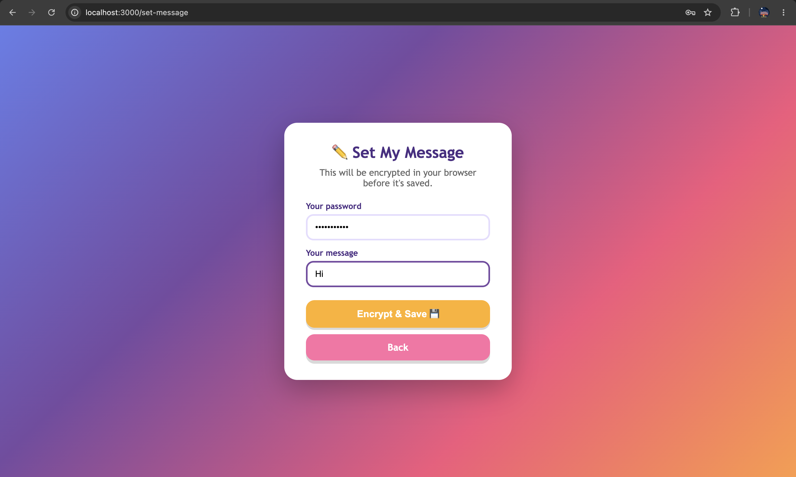
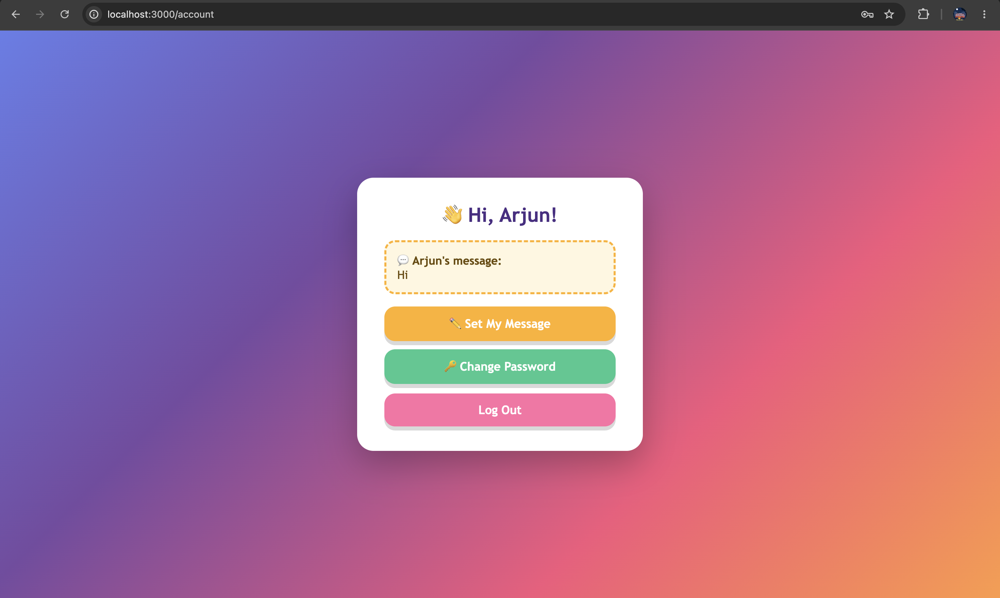

# CS Lab 1 - Client-Side Message Encryption

This repository contains the solution for CS Lab 1, which enhances a simple Node.js/Express class portal by implementing **client-side message encryption** using the native Web Crypto API.

## Features Added
- Secure password hashing using `SHA-256`.
- Client-side encryption and decryption of personal messages using `AES-GCM`.
- Storage of ciphertext and a randomly generated Initialization Vector (IV) instead of plaintext.
- Zero network requests during message decryption on the account page.

## Installation Guidelines

1. **Clone the repository:**
   ```bash
   git clone https://github.com/anjanshivareddy/CS.git
   cd CS/lab1
   ```

2. **Install dependencies:**
   Ensure you have Node.js installed, then run:
   ```bash
   npm install
   ```
   *(Note: The `better-sqlite3` dependency handles database storage locally).*

## Execution Guidelines

1. **Start the server:**
   ```bash
   npm start
   ```
   *The database (`classmates.db`) is created automatically the first time you run the app, with sample accounts to log in with (e.g., `meera` / `SummerFun2024`, `arjun` / `Football123`).*

2. **Access the application:**
   Open your browser to [http://localhost:3000](http://localhost:3000)

3. **Test the Encryption flow:**
   - Log in to the application.
   - Go to "Set My Message" (the `set-message` route).
   - Enter your password and your desired message, then click **Encrypt & Save**.
   - You will be redirected to the account page, where your message is displayed in a **🔒 Locked** state.
   - Enter your password in the unlock box and click **Unlock 🔓** to seamlessly decrypt the message on the client-side.

---

## Explanation of Approach

To fulfill the assignment requirements without using any external crypto libraries, we utilized the browser's built-in `crypto.subtle` API. All cryptographic functions are centralized in `public/crypto.js`.

1. **Key Derivation (`hashPassword` & `importAesKey`):**
   When a user sets or unlocks a message, their raw password is hashed using **SHA-256**. This 256-bit (32-byte) hash digest is directly imported as an **AES-GCM** key. No salts or PBKDF2 were used, per assignment instructions.

2. **Client-Side Encryption (`encryptData` & `generateIv`):**
   Before the `set-message` form is submitted, the JavaScript intercepts it. A fresh 12-byte random Initialization Vector (IV) is generated using `crypto.getRandomValues()`. The plaintext message is encrypted with the AES-GCM key and the IV. Only the resulting `ciphertext` and the `IV` (both converted to Base64) are injected into hidden form fields and sent to the server. The plaintext and password fields are cleared to ensure they never reach the network.

3. **Database Storage:**
   The `accounts` table schema in `db.js` was modified to add a new `message_iv` column. The Express backend blindly receives the Base64 ciphertext and IV, updating the database. The server never sees the plaintext or the password. 

4. **Client-Side Decryption (`decryptData`):**
   When the user visits their account page, the server embeds the Base64 ciphertext and IV into the HTML. The message is initially hidden behind a locked UI. When the user enters their password and clicks unlock, `crypto.js` derives the AES key again, parses the Base64 IV and ciphertext back into `ArrayBuffer`s, and decrypts the data locally. This entire process happens instantaneously in the browser, requiring **zero network requests**.

---

## Screenshots

### 1. Login Page


### 2. Set My Message (Encryption)
*Entering the password and message. Upon submission, the network tab will show only the ciphertext and IV being POSTed, not the plaintext.*


### 3. Locked Message State
*The account page defaults to a locked state, requiring the password to decrypt.*


### 4. Unlocked Message State
*After unlocking, the plaintext is revealed entirely on the client-side without any network request.*

